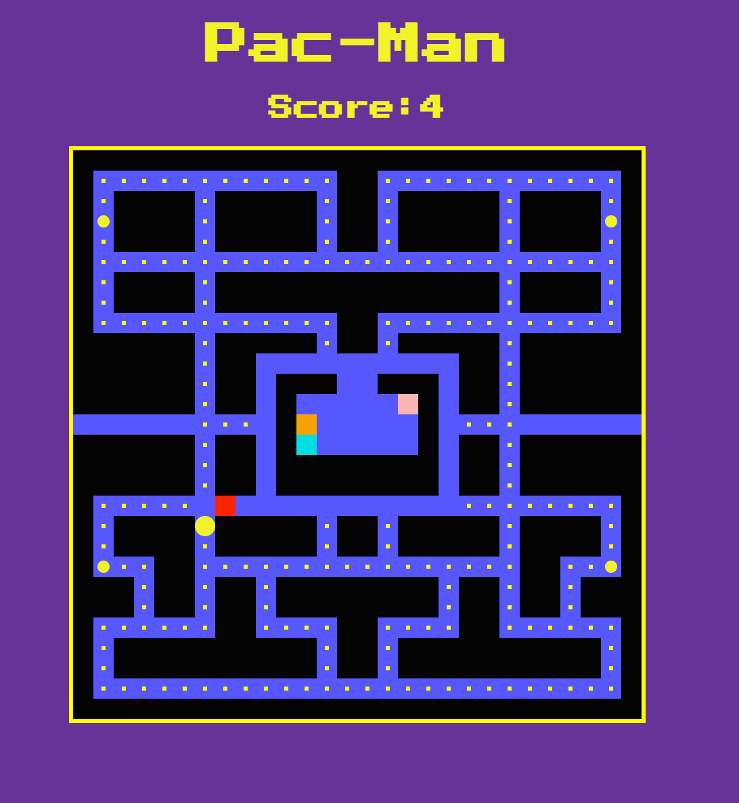
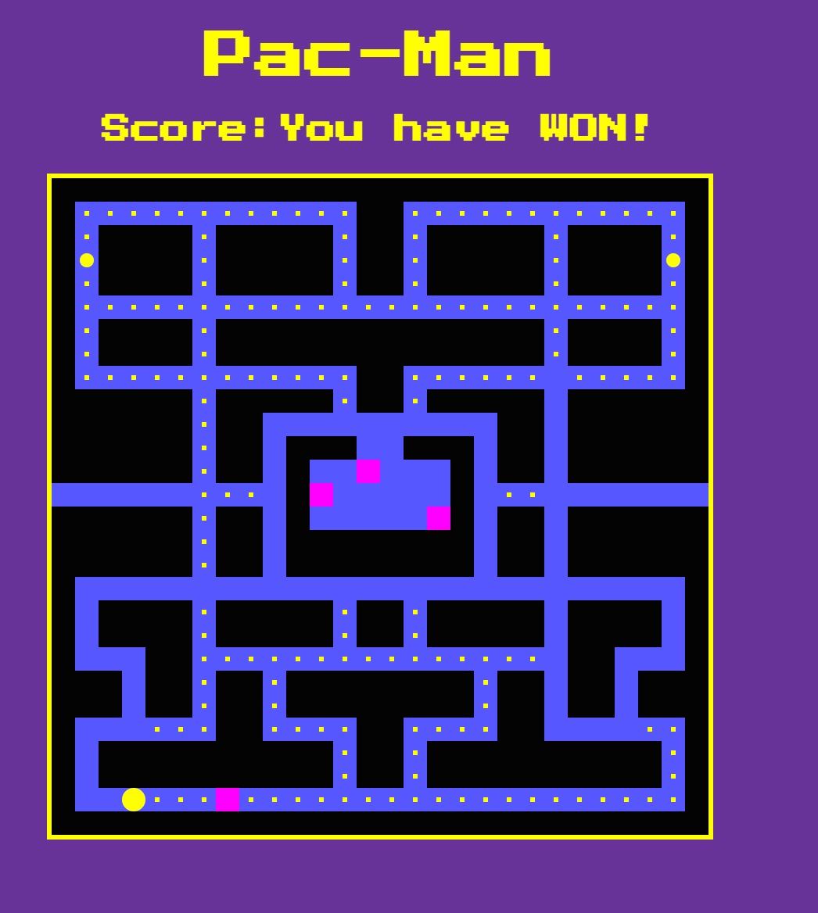
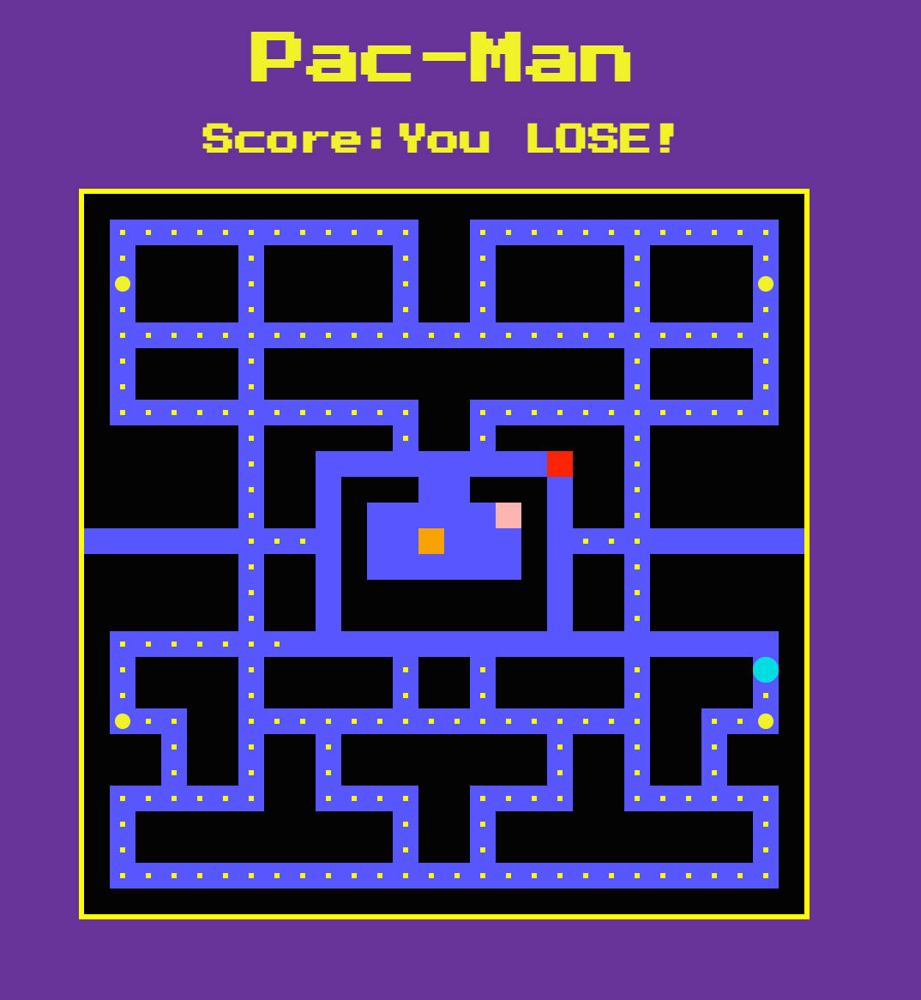

# Pac-Man Game

Created this game with Vanilla Javascript, HTML and CSS on which you can play basic Pac-Man (for desktop).

[Live Demo](https://stefi.codes/pac-man/)



## How it works

In order to play use the arrow keys and try to eat all the pac-dots on the board. Make sure you don't get eated by the ghosts.

## Technologies

Javascript, HTML and CSS.

## Why I've build this game?

I've followed the tutorial by [Ania Kubów](https://twitter.com/ania_kubow) as part of a [Scrimba Frontend Developer Career Path](https://scrimba.com).

Repetition is key so I decided to build this game in order to practice more. Plus it's always fun to code with Ania.

## Install and Play

```
Play it online or
git clone https://github.com/stefi23/pac-man
open the index.html
play
```

### More images




